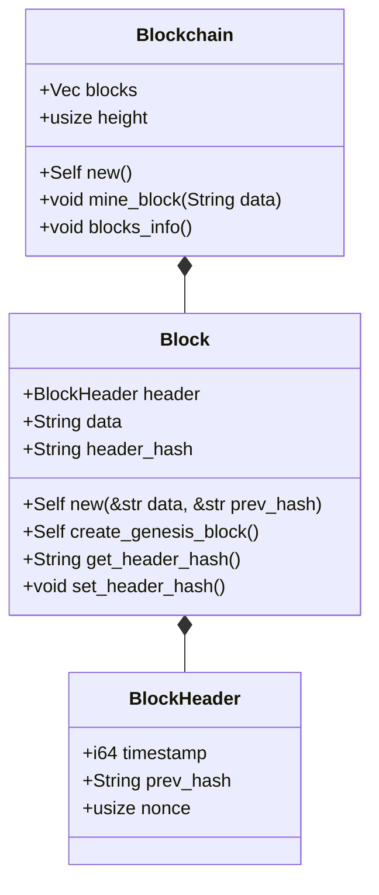

# PART 1 笔记

该阶段实现的区块链功能非常简单易懂。
- 定义了区块链的基础数据结构（区块头、区块和区块链）
- 定义了求取区块头哈希的函数
- 实现了往区块链中加入新区块的简易流程，详见`Blockchain.mine_block()`函数
  - 需要注意的是，该阶段加入新区块的算法并非共识算法，只是简单地将新区块的`prev_hash`设置为上一个区块的`header_hash`，然后就直接塞进区块链的区块数组中了。

## 类图

类图结构非常简单明了。不再赘述。

<!--https://mermaid.js.org/syntax/classDiagram.html#defining-relationship-->

## 除类图外的细节

本阶段想对`BlockHeader`进行求取哈希值的操作，我们需要一种手段将一个`BlockHeader`给序列化为字节流，然后对该字节流求取哈希值。

- 序列化和反序列化：由`serde crate`实现。
- 哈希函数：由`rust-crypto crate`中的`SHA3-256`算法实现。

## 关键三方库依赖

| 名称        | 作用                                                                                            | 备注                                                                                        |
| ----------- | ----------------------------------------------------------------------------------------------- | ------------------------------------------------------------------------------------------- |
| anyhow      | 出现在`utils/serializer.rs`中，用于提供特殊的Result类型，让报错信息更直观。                     | 需要`std`。[anyhow](https://crates.io/crates/anyhow)                                        |
| chrono      | 出现在`blocks/block.rs`中，用于获取时间戳。                                                     | 需要`std`。但是仅需将`use`语句删除即可摆脱此依赖。[chrono](https://crates.io/crates/chrono) |
| tracing     | 出现在`blocks/blockchain.rs`中，用于打印日志信息。                                              | 和`tracing-subscriber`一起使用。[tracing](https://crates.io/crates/tracing)                 |
| thiserror   | 出现在`error.rs`中，用于自定义错误类型。                                                        | 尚不明确是否需要`std`。[thiserror](https://crates.io/crates/thiserror)                      |
| rust-crypto | 出现在`utils/serializer.rs`中，用于哈希运算。                                                   | 尚不明确是否需要`std`。[rust-crypto](https://crates.io/crates/rust-crypto)                  |
| serde       | 出现在`utils/serializer.rs`中，用于提供序列化和反序列化的`trait`。                              | 尚不明确是否需要`std`。[serde](https://crates.io/crates/serde)                              |
| bincode     | 出现在`utils/serializer.rs`中，用于序列化和反序列化。具体来说，可以将一个struct序列化为字节流。 | 尚不明确是否需要`std`。[serde](https://crates.io/crates/bincode)                            |

## 移植！

大工程。
